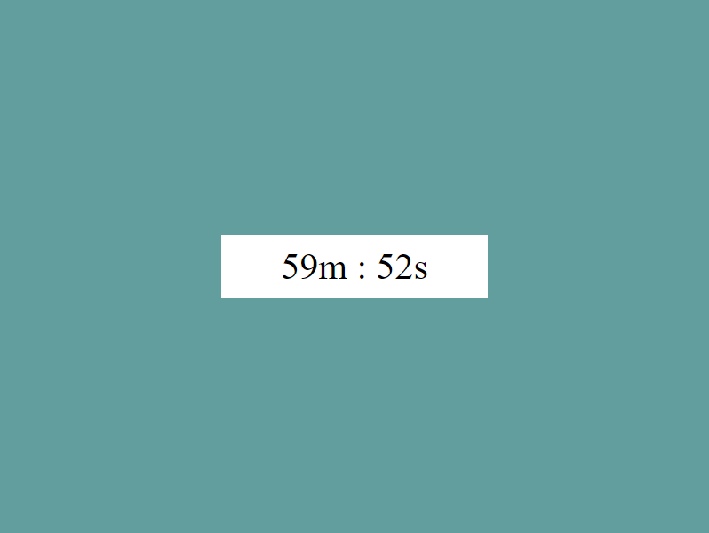

# Проект: Time count
## Основная информация:
__Time count__ - это таймер обратного отсчёта

* Простой таймер [посмотреть](https://jelexio.github.io/Time-count/)
* Используются минуты и секунды
* Значение выводиться в блок, расположенный по центру

> Начиная с определённой точки, возврат уже невозможен. Этой точки надо достичь.   _Франц Кафка (1883–1924)_

 

## Дополнительная информация:
[Документация проекта](./assets/service/document.txt)

***

[Наверх](#anchor)